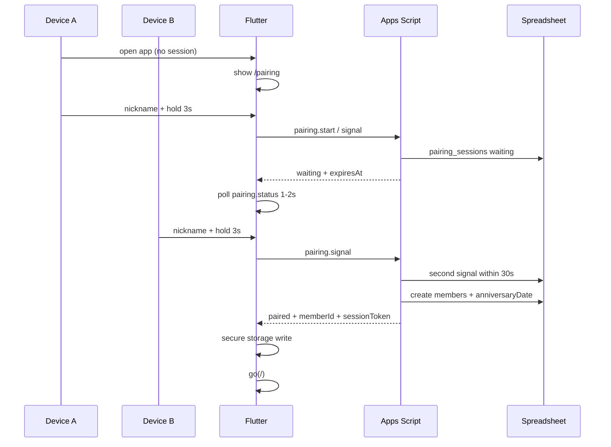
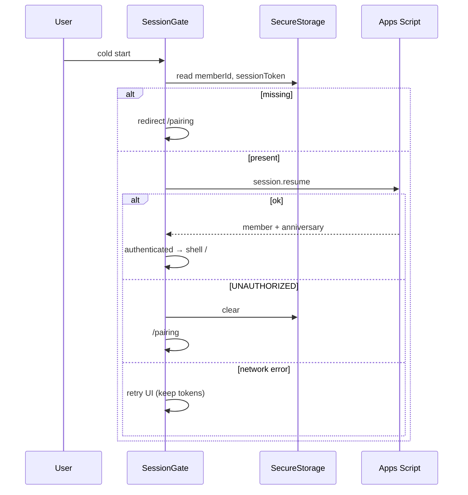
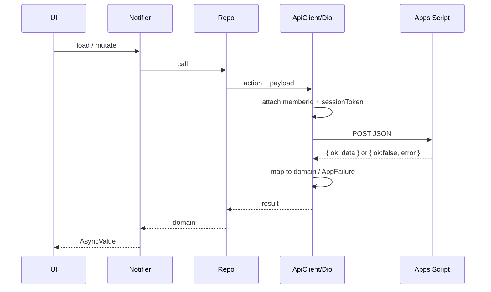
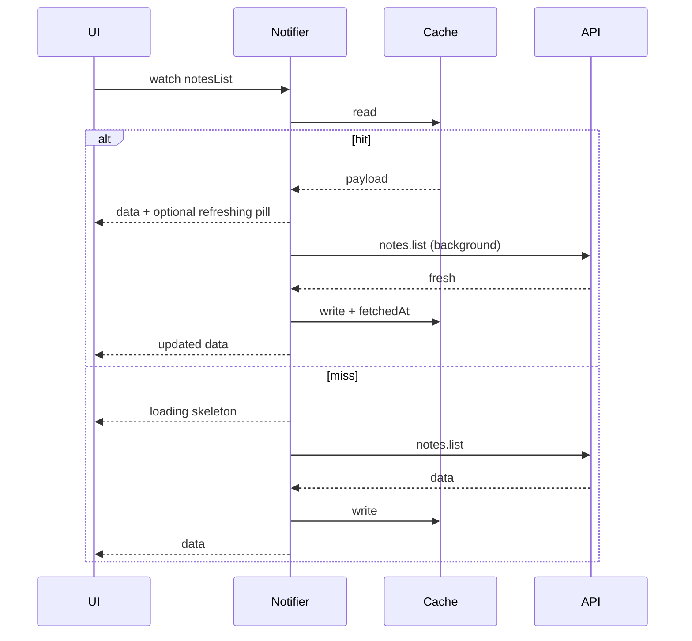
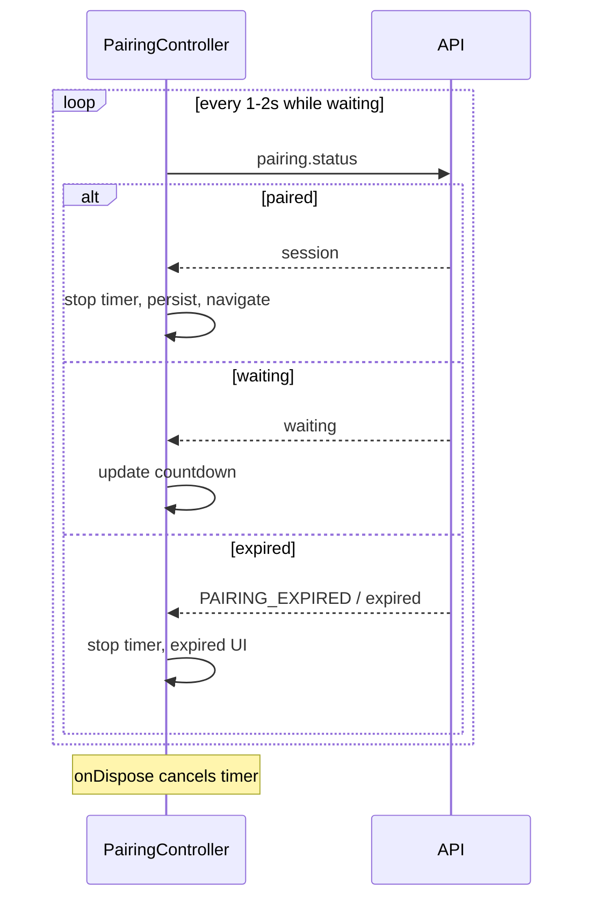
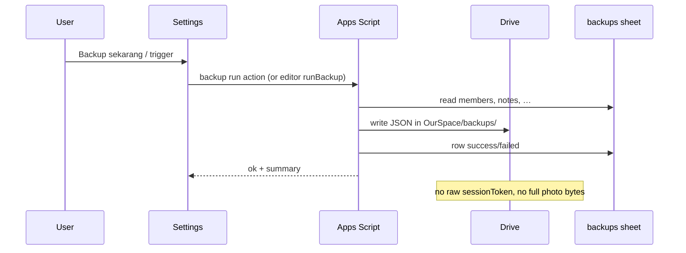
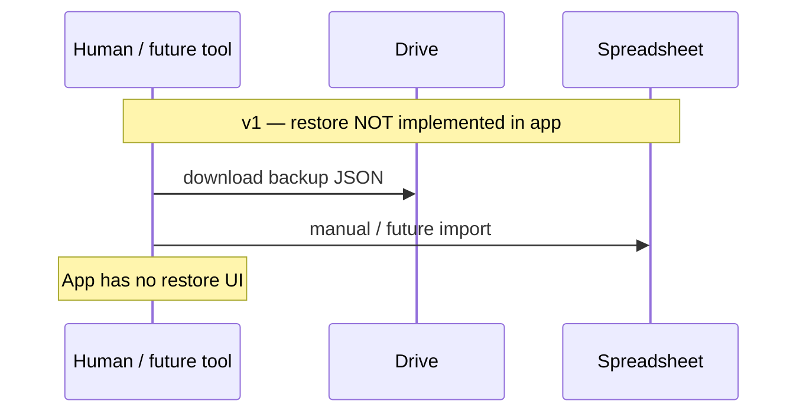

# Sequence diagrams

> Critical flows for implementers and AI agents. Mermaid-compatible.

**Related:** [pairing-flow.md](./pairing-flow.md) · [routing.md](./routing.md) · [state-management.md](./state-management.md) · [api-contract.md](./api-contract.md) · [backup.md](./backup.md)

---

## 1. Pairing (success)

---

## 2. Authentication (session resume)

---

## 3. API request (authenticated)

---

## 4. Cache refresh (stale-while-revalidate)

---

## 5. Pairing polling

---

## 6. Backup (manual / trigger)

---

## 7. Restore

Product: restore is explicitly out of scope for automatic in-app flow ([backup.md](./backup.md)).
